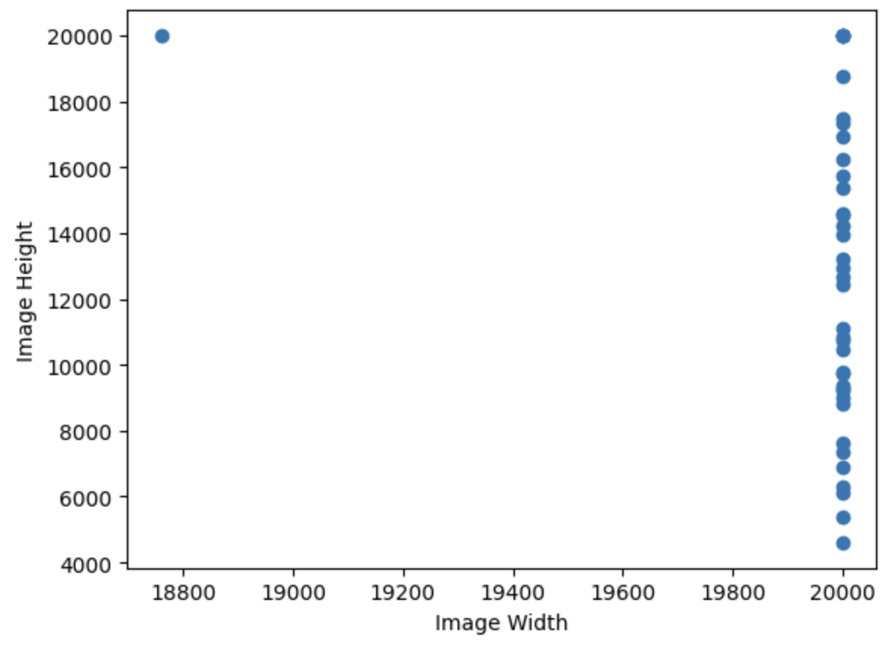
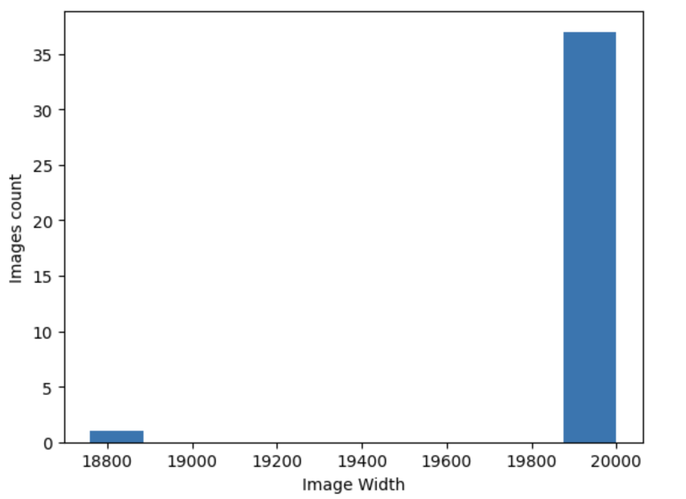

# UBC Ovarian Cancer Subtype Classification
## DATA ANALYSIS
The primary objective of our study revolves around the classification of ovarian cancer subtypes through the analysis of histopathology images derived from biopsy samples. This extensive dataset, comprising microscopy scans, originates from over 20 distinguished medical centers, providing a diverse and representative collection of cases.

Within this dataset, we encounter the task of multiclass image classification, specifically aiming to discern between five prevalent subtypes of ovarian cancer. These subtypes encompass high-grade serous carcinoma (HGSC), clear-cell ovarian carcinoma (CC), endometrioid carcinoma (EC), low-grade serous carcinoma (LGSC), and mucinous carcinoma (MC). Consequently, our classification task involves navigating through the complexities of distinguishing among these distinct subcategories.

It is essential to highlight the inherent challenge posed by the imbalanced distribution of classes within our dataset. The prevalence of each subtype varies significantly, with HGSC constituting approximately 41.2% of the dataset, followed by EC at approximately 23%, CC at around 18.4%, LGSC at 8.8%, and MC at 8.6%. This imbalance necessitates careful consideration and tailored strategies during model development to ensure fair and effective learning across all classes.

To provide a visual representation of the data, we include sample whole slide images from the training dataset, offering a glimpse into the intricate and varied histopathological patterns that characterize each ovarian cancer subtype as shown below :

It can be observed that the same subtype of cancer i.e. HGSC image looks different. The variation in HGSC image appearance arises from diverse staining techniques used across different labs, introducing challenging color variations. Our dataset, reflecting this heterogeneity, necessitates a robust training approach to generalize across staining discrepancies. Mitigating color variations will be crucial for training success.

### Distribution of Image Heights and Image Widths in Training Dataset

From the histogram of image width, we observed that almost every image has an image width of 20000 pixels, while from the histogram of image height, it is clear that image height varies from around 4000 to 20000 pixels. An essential observation is the prevalence of very large-sized images within our training dataset, with a standardized width of 20,000 pixels.

## METHODS
### APPROACH 1: PRETRAINED EFFICIENTNETB0 & EFFICIENTNETB3
For our first approach we started with EfficientNetB0 & B3 [2] with the base data. We noticed that these were the models that were most popular on Kaggle.
Why?
These were large models that others were also using on Kaggle. We believed that they would translate well for WSI classification.
#### Approach + Modifications
We leveraged pre-trained models as feature extractors by keeping their layers frozen. We augmented these models by appending classification layers and subsequently fine-tuned the entire architecture. We played around with multiple variants of the classification layers, before settling on 4 layers which then output to a softmax.
#### Issues
We noticed that the EfficientNetB0 was overfitting despite our best efforts. We thought we might need to try a different model
 
#### Original Model: EfficientNetB0 and EfficientNetB3
EfficientNet is a family of convolutional neural networks designed for efficient performance with a focus on scaling up networks in a balanced way across depth, width, and resolution. This scaling is guided by a compound coefficient, which ensures that each of these dimensions is scaled uniformly, leading to models that are both powerful and efficient.
Advantages of EfficientNet are -
●   Efficiency: EfficientNet models tend to achieve state-of-the-art performance while being computationally efficient, making them suitable for resource-constrained environments.
●   Scalability: The compound scaling allows these models to be scaled up or down based on the requirements of the task.

### EfficientNetB0 Model Architecture

II. APPROACH 2: PRETRAINED RESNET18 & RESNET101
For our first approach we started with EfficientNetB0 & B3 [2] with the base data. We noticed that these were the models that were most popular on Kaggle.
Why?
We were not satisfied with the performance of EfficientNet, so we wanted to try with another style of model. This model was also popular on Kaggle so we tried it.
Approach + Modifications
We leveraged pre-trained models as feature extractors by keeping their layers frozen. We augmented these models by appending classification layers and subsequently fine-tuned the entire
 
 architecture. We played around with multiple variants of the classification layers, before settling on adding 3 layers which then output to a softmax.
Issues
We noticed that the Resnet was performing better than EfficientNetB0. We also noticed that the default Resnet was trained on an input of 288 but we increased the input size to 512 and saw considerable improvement. However we felt like the class imbalance may be causing issues
Original Model: ResNet18 and ResNet101
ResNet (Residual Network) is a deep neural network architecture known for its use of residual blocks allowing the input of a layer to be added to its output. These connections help alleviate the vanishing gradient problem in deep networks by enabling deeper layers to learn incremental changes to the identity function, thus facilitating training of much deeper networks effectively.
ResNet18 and ResNet101 are specific variants with 18 and 101 layers, respectively.
We used ResNet because of the following reasons -
● Residual Learning: The use of residual connections helps in mitigating the vanishing
gradient problem, allowing the training of very deep networks.
● Transfer Learning: Pre-trained ResNet models, trained on large datasets like ImageNet,
have proven to be effective feature extractors in transfer learning scenarios.
● Versatility: ResNet architectures have demonstrated strong performance across a wide
range of computer vision tasks, making them a versatile choice.
ResNet 18 Model Architecture
 II. Approach 3: Class Weights during Optimization to handle Data Imbalance Why?

   The number of examples among the different categories (in this case, types of ovarian cancer) is not evenly distributed. Specifically, the dataset consists of images of High-Grade Serous Carcinoma (HGSC) with 175 instances, Endometrioid Carcinoma (EC) with 98 instances, Clear Cell Carcinoma (CC) with 80 instances, and much fewer instances of Low-Grade Serous Carcinoma (LGSC) and Mucinous Carcinoma (MC), each with only 35 instances.
Approach + Modifications
We tweaked the optimization algorithm to weigh the minority classes more heavily, essentially penalizing the model more for misclassifying instances belonging to underrepresented classes. This tactic was also unsuccessful, as observed by a decrease in validation performance. This could be caused by the model becoming too focused on the minority classes, leading to overfitting those classes at the expense of overall performance.
Issues
After experiencing reduced validation performance with both these methods, the decision was made not to use any class balancing techniques. It illustrates a challenging aspect of working with imbalanced datasets wherein common balancing techniques can sometimes adversely affect the model's ability to generalize to new data, as witnessed by decreased performance in the validation phase.
II. Approach 4: Augment the Data
Why?
Our dataset faced challenges due to its limited size, which posed constraints on the breadth and diversity of the data available for analysis. Additionally, there was a notable class imbalance, as illustrated in the previous section. This imbalance and limited dataset size could potentially affect the reliability and generalizability of any analytical models or conclusions drawn from the data.
Approach + Modifications
In our machine learning experiment, we implemented a comprehensive data augmentation strategy to improve the robustness and generalizability of our model. Our approach involved applying several techniques, each carefully chosen for its specific benefits:

 ● Image Flipping: This technique involves flipping images horizontally or vertically. It's particularly useful for training the model to recognize objects in various orientations, increasing its ability to generalize from the training data.
● Image Rotation: We randomly rotated images to various degrees. This not only simulates different viewing angles but also helps in training the model to be invariant to rotation changes.
● Color Saturation Adjustments: By altering the saturation levels, we prepared our model to handle images with varying color intensities, which is common in real-world scenarios.
● Random Crop: This method involves cropping random parts of the image, which helps in training the model to recognize features and objects even when they are partially obscured or located in different regions of the image.
● Random Posterize: By reducing the color depth of images, this technique introduces a level of abstraction, forcing the model to focus on structural features rather than relying heavily on color information.
● Gaussian Blur: Applying a Gaussian blur to images mimics the effect of out-of-focus photography, teaching the model to extract relevant features even in less-than-ideal image clarity conditions.
● Color Jitter: This was a crucial step in our data augmentation process. We noticed that the samples, being from different labs, exhibited slight variations in color representation. By adjusting aspects like brightness, contrast, and saturation randomly, we aimed to make our model more resilient to these variations.
Fig: Color difference in the images
Issues
The method improved the accuracy of the system. No issues were seen with this. However we wanted better results.
II. Approach 5: CutMix & MixUp Data Augmentation
Why?
Our dataset faced challenges due to its limited size, which posed constraints on the breadth and diversity of the data available for analysis. Additionally, there was a notable class imbalance, as illustrated in the previous section. This imbalance and limited dataset size could potentially affect the reliability and generalizability of any analytical models or conclusions drawn from the data.
Approach + Modifications
  
 In our project, we applied these techniques to a cancer dataset with the intention of enhancing its diversity, especially for underrepresented image types.
CutMix works by cutting and pasting patches between training images. Specifically, it randomly selects a patch in one image and replaces it with a patch from another image. This process not only mixes the contents of two images but also encourages the model to focus on less prominent features, as the main object in the image might be partially obscured or altered. The labels are also mixed proportionally to the area of the patches. This technique can be particularly useful in datasets with imbalanced classes, as it allows the model to learn from a more varied set of features.
MixUp, on the other hand, blends two images together by taking a weighted average of them. This blending is not just limited to the pixel values; the labels are also combined in a similar weighted manner. For instance, if an image of a cat and a dog are mixed with equal weights, the resulting image will have features of both, and the label will also be a mix, indicating 50% cat and 50% dog. This encourages the model to learn more robust features, as it has to deal with images that are not as clearly defined as in the original dataset.
Issues
However, we observed no improvement in model performance with these augmented images. We believe, the nature of the cancer images might be such that these specific augmentation techniques do not effectively introduce beneficial variance into the dataset.
II. FINAL MODEL
After much experimentation with Augmentation & models we obtained the best results with a Resnet 101 model attached to a dense neural network with 3 layers, layers containing 128, 64,5 which is then connected to a softmax connected to 5 classes.
 Final Augmentation Steps used:
Fig: Model Architecture

● Rotation: Reiterating the importance of rotational invariance, we continued to apply random rotations in our final augmentation phase.
● Color Jitter: Given its significance in handling inter-lab variations, we maintained color jitter in our final augmentation steps.
● Normalization: This was a critical addition in our final phase. By normalizing the images, we ensured that the pixel values had a consistent range, facilitating more stable and faster convergence during training.
Fig: Depiction of Final Augmentation
II. MODEL VALIDATION
To perform model validation and ensure that the distribution of classes in the training and validation sets reflects the original dataset, a stratified split approach was utilized. This technique involves dividing the data in such a way that each set contains approximately the same percentage of samples of each target class as the complete set. Specifically, 20% of the data was reserved for validation purposes. By using this stratified sampling technique, we aimed to maintain the original class imbalance ratio within both the training and validation datasets, thus enabling a more reliable evaluation of the model's performance that would not be biased by the distribution of the classes. This approach allowed us to have confidence in our results, as it mitigated the risk of skewed model performance metrics that could arise if the validation data did not representatively mirror the full spectrum of the classes within the dataset.

