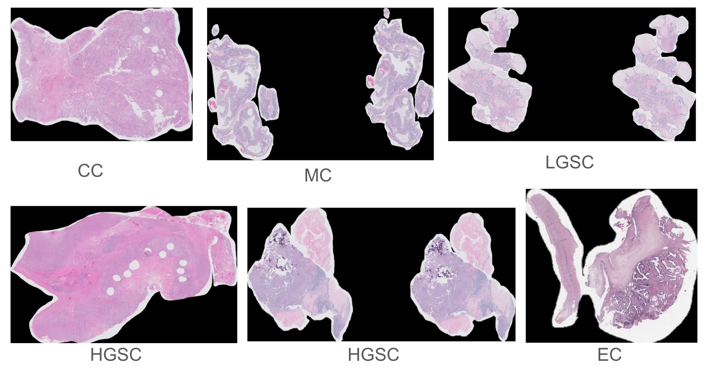

# UBC Ovarian Cancer Subtype Classification
## Data Analysis
The primary objective of our study revolves around the classification of ovarian cancer subtypes through the analysis of histopathology images derived from biopsy samples. This extensive dataset, comprising microscopy scans, originates from over 20 distinguished medical centers, providing a diverse and representative collection of cases.

Within this dataset, we encounter the task of multiclass image classification, specifically aiming to discern between five prevalent subtypes of ovarian cancer. These subtypes encompass high-grade serous carcinoma (HGSC), clear-cell ovarian carcinoma (CC), endometrioid carcinoma (EC), low-grade serous carcinoma (LGSC), and mucinous carcinoma (MC). Consequently, our classification task involves navigating through the complexities of distinguishing among these distinct subcategories.

It is essential to highlight the inherent challenge posed by the imbalanced distribution of classes within our dataset. The prevalence of each subtype varies significantly, with HGSC constituting approximately 41.2% of the dataset, followed by EC at approximately 23%, CC at around 18.4%, LGSC at 8.8%, and MC at 8.6%. This imbalance necessitates careful consideration and tailored strategies during model development to ensure fair and effective learning across all classes.

To provide a visual representation of the data, we include sample whole slide images from the training dataset, offering a glimpse into the intricate and varied histopathological patterns that characterize each ovarian cancer subtype as shown below :

